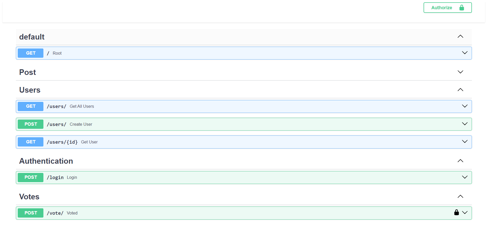
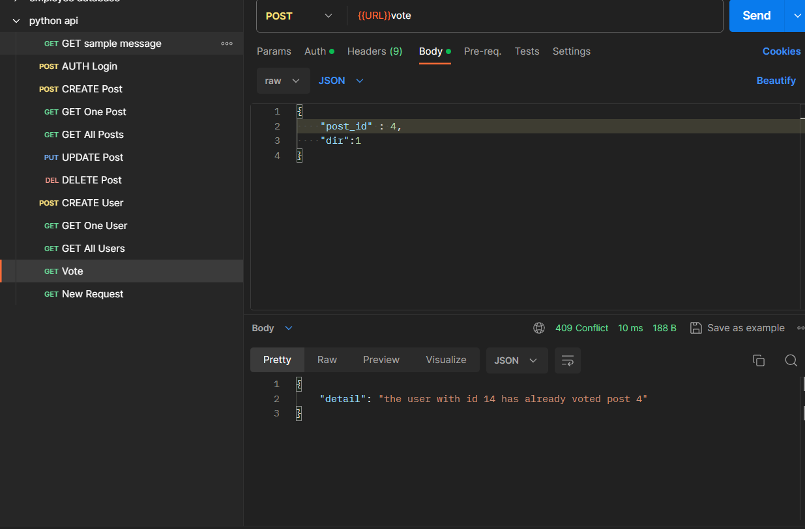

# FastCRUD

## Overview

FastCRUD is a full-stack project built using FastAPI, Python, PostgreSQL, and Alembic. It features a database schema with tables for users, posts, and votes, allowing users to perform CRUD operations on their posts. The project includes authentication using bearer tokens, post creation with automatic user assignment, and secure password storage with hash encryption. The HTTP requests are documented in FastAPI docs and can be verified using tools like Postman.

## Features

- **User Management:** CRUD operations for users with secure password storage.
- **Post Management:** CRUD operations for posts, with automatic user assignment and timestamp tracking.
- **Vote Tracking:** A votes table to keep track of posts liked by specific users.
- **Authentication:** Bearer token authentication for user login.
- **Authorization:** Users can only perform CRUD operations on their own posts.
- **Database:** PostgreSQL is used for the database, and Alembic is used for managing database schema migrations.

## Technologies Used

- FastAPI (Python web framework)
- PostgreSQL (Relational database)
- Alembic (Database migrations)
- Postman(HTTP requests)

## Install Dependencies:

pip install -r requirements.txt

## Run the FastAPI Application:

uvicorn app.main:app --reload

## Access FastAPI Docs:

http://127.0.0.1:8000/docs
This will allow you to explore and test the API using the interactive documentation.

## Postman
You can also test the API using Postman. Import the provided Postman collection for easy testing of various API endpoints.

## Database Migrations
Create Initial Migration:
alembic revision --autogenerate -m "Initial migration"

## Apply Migrations: 

alembic upgrade head

## Testing
pytest

## Screenshots

